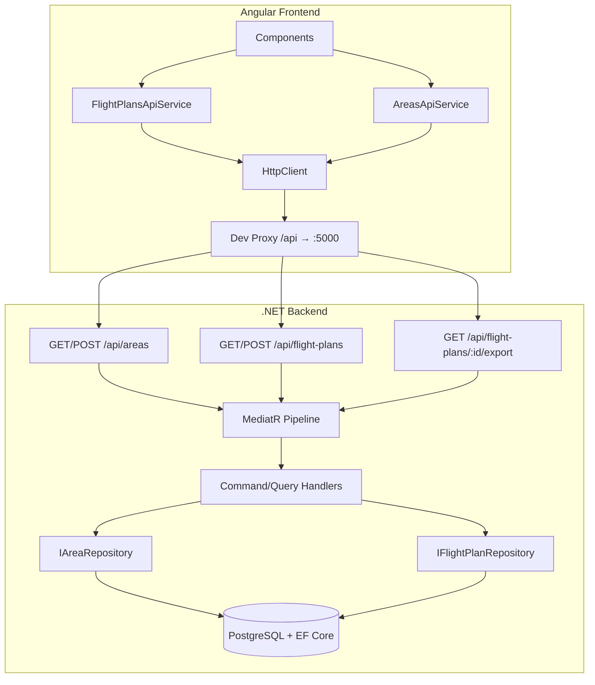

# Design Document: Frontend API Integration

## Overview

This design covers full integration of the Angular frontend (DroneMesh3D Web) with the existing .NET backend (DroneMesh3D Api). The current frontend only supports creating and fetching a single area. This feature extends the frontend with:

- TypeScript model interfaces matching all backend DTOs (flight plans, waypoints, statistics, parameters)
- A new `FlightPlansApiService` for flight plan operations (calculate, get, list, export)
- Extension of `AreasApiService` with list functionality
- Mission file download with Content-Disposition filename extraction
- Consistent HTTP error handling across all API services

On the backend side, two new LIST endpoints are added:
- `GET /api/areas` — returns all areas
- `GET /api/flight-plans` — returns flight plans with optional filtering, ordering, and pagination

The design follows existing conventions: Angular `inject()` pattern, barrel exports, kebab-case file naming, MediatR CQRS on the backend, and the proxy-based development setup (`/api` → `localhost:5000`).

## Architecture



### Key Design Decisions

1. **No HTTP interceptor for error transformation** — Services propagate `HttpErrorResponse` directly. Components interpret errors using shared helper utilities. This keeps services pure and avoids hidden global behavior.

2. **Blob response for export** — The export endpoint returns a file as `responseType: 'blob'`. The filename is extracted from the `Content-Disposition` header. A reusable utility function handles the browser download trigger.

3. **Backend LIST endpoints use MediatR queries** — Consistent with existing GET-by-ID patterns. New `ListAreasQuery` and `ListFlightPlansQuery` are added.

4. **Pagination via limit/offset** — Simple, stateless pagination for the flight plans list endpoint. Default limit=100, offset=0.

## Components and Interfaces

### Frontend TypeScript Models

All models reside in `Web/src/app/api/models/`, one interface per file, exported via barrel `index.ts`.

| File | Interface/Type | Purpose |
|------|---------------|---------|
| `flight-plan-response.ts` | `FlightPlanResponse` | Response DTO for flight plan data |
| `waypoint-dto.ts` | `WaypointDto` | Single waypoint in a flight plan |
| `flight-statistics-dto.ts` | `FlightStatisticsDto` | Flight plan computed statistics |
| `calculate-flight-path-request.ts` | `CalculateFlightPathRequest` | Request body for flight path calculation |
| `grid-mode-parameters-dto.ts` | `GridModeParametersDto` | Grid flight mode parameters |
| `camera-parameters-dto.ts` | `CameraParametersDto` | Camera sensor parameters |
| `poi-mode-parameters-dto.ts` | `PoiModeParametersDto` | POI flight mode parameters |
| `flight-mode.ts` | `FlightMode` | `'Grid' \| 'Poi'` string literal type |
| `export-format.ts` | `ExportFormat` | `'LitchiCsv' \| 'Kml' \| 'DjiWpml'` string literal type |

Existing models retained unchanged: `AreaResponse`, `CreateAreaRequest`, `ErrorResponse`, `ValidationErrorResponse`.

### FlightPlansApiService

```typescript
@Injectable({ providedIn: 'root' })
export class FlightPlansApiService {
  private readonly http = inject(HttpClient);
  private readonly basePath = '/api/flight-plans';

  calculate(body: CalculateFlightPathRequest): Observable<FlightPlanResponse>;
  getById(id: string): Observable<FlightPlanResponse>;
  list(params?: { areaId?: string }): Observable<FlightPlanResponse[]>;
  exportMissionFile(id: string, format: ExportFormat): Observable<HttpResponse<Blob>>;
}
```

- `calculate` → `POST /api/flight-plans`
- `getById` → `GET /api/flight-plans/{id}`
- `list` → `GET /api/flight-plans?areaId={areaId}`
- `exportMissionFile` → `GET /api/flight-plans/{id}/export?format={format}` with `responseType: 'blob'` and `observe: 'response'` to access headers

### AreasApiService Extension

```typescript
// Added method to existing AreasApiService:
listAreas(): Observable<AreaResponse[]>;
```

- `listAreas` → `GET /api/areas`

### File Download Utility

```typescript
// Web/src/app/api/utils/file-download.ts
export function triggerBlobDownload(response: HttpResponse<Blob>): void;
export function extractFilename(contentDisposition: string | null): string;
```

Extracts filename from `Content-Disposition` header (e.g., `attachment; filename="flight-plan-abc.csv"`) and triggers browser download using `URL.createObjectURL` + anchor click pattern.

### Backend New Queries

| Query | Handler | Returns |
|-------|---------|---------|
| `ListAreasQuery` | `ListAreasQueryHandler` | `List<AreaResponse>` |
| `ListFlightPlansQuery(Guid? AreaId, int Limit, int Offset)` | `ListFlightPlansQueryHandler` | `List<FlightPlanResponse>` |

### Backend Repository Extensions

```csharp
// IAreaRepository additions:
Task<List<AreaEntity>> GetAllAsync(CancellationToken ct = default);

// IFlightPlanRepository additions:
Task<List<FlightPlanEntity>> ListAsync(Guid? areaId, int limit, int offset, CancellationToken ct = default);
```

## Data Models

### TypeScript Interfaces (Frontend)

```typescript
export interface FlightPlanResponse {
  id: string;
  areaId: string;
  mode: string;
  waypoints: WaypointDto[];
  statistics: FlightStatisticsDto;
  createdAt: string;
}

export interface WaypointDto {
  latitude: number;
  longitude: number;
  altitudeAglM: number;
  gimbalPitchDegrees: number;
  gimbalYawDegrees: number;
}

export interface FlightStatisticsDto {
  totalDistanceM: number;
  estimatedFlightTimeS: number;
  photoCount: number;
  coveredAreaM2: number;
}

export interface CalculateFlightPathRequest {
  areaId: string;
  mode: FlightMode;
  grid: GridModeParametersDto | null;
  poi: PoiModeParametersDto | null;
}

export interface GridModeParametersDto {
  altitudeM: number;
  camera: CameraParametersDto;
  frontOverlapPercent: number;
  sideOverlapPercent: number;
  headingDegrees: number | null;
}

export interface CameraParametersDto {
  sensorWidthMm: number;
  focalLengthMm: number;
  imageWidthPx: number;
  imageHeightPx: number;
}

export interface PoiModeParametersDto {
  centerLatitude: number;
  centerLongitude: number;
  radiusM: number;
  altitudeM: number;
  gimbalPitchDegrees: number;
  photoCount: number | null;
  overlapPercent: number | null;
  cameraHorizontalFovDegrees: number | null;
  structureHeightM: number | null;
}

export type FlightMode = 'Grid' | 'Poi';
export type ExportFormat = 'LitchiCsv' | 'Kml' | 'DjiWpml';
```

### Backend Query Models

```csharp
public record ListAreasQuery() : IRequest<List<AreaResponse>>;

public record ListFlightPlansQuery(Guid? AreaId, int Limit = 100, int Offset = 0)
    : IRequest<List<FlightPlanResponse>>;
```

### HTTP Response Contracts

| Endpoint | Success | Error Cases |
|----------|---------|-------------|
| `GET /api/areas` | `200` — `AreaResponse[]` | `500` — `ErrorResponse` |
| `GET /api/flight-plans` | `200` — `FlightPlanResponse[]` | `422` — `ValidationErrorResponse` (bad areaId), `500` — `ErrorResponse` |
| `GET /api/flight-plans/{id}/export` | `200` — file blob + Content-Disposition | `404` — not found, `422` — validation error, `500` — server error |

## Correctness Properties

*A property is a characteristic or behavior that should hold true across all valid executions of a system — essentially, a formal statement about what the system should do. Properties serve as the bridge between human-readable specifications and machine-verifiable correctness guarantees.*

### Property 1: FlightPlanResponse serialization round-trip

*For any* valid `FlightPlanResponse` object (with arbitrary waypoints, statistics, id, areaId, mode, and createdAt values), serializing it to JSON and deserializing it back should produce an object with all fields equal to the original.

**Validates: Requirements 1.1, 1.2, 1.3**

### Property 2: CalculateFlightPathRequest serialization round-trip

*For any* valid `CalculateFlightPathRequest` object (with either Grid or Poi parameters, including null variants), serializing it to JSON and deserializing it back should produce an object with all fields equal to the original.

**Validates: Requirements 1.4, 1.5, 1.6, 1.7**

### Property 3: FlightPlansApiService constructs correct HTTP requests

*For any* valid method call on `FlightPlansApiService` (calculate with any `CalculateFlightPathRequest`, getById with any GUID string, list with any optional `areaId`, export with any GUID and `ExportFormat`), the service shall issue an HTTP request with the correct method, URL path, query parameters, request body, and response type.

**Validates: Requirements 2.1, 2.2, 2.3, 4.1, 5.1**

### Property 4: API services propagate HTTP errors unchanged

*For any* HTTP error status code returned by the backend, both `FlightPlansApiService` and `AreasApiService` shall propagate the `HttpErrorResponse` through the Observable error channel without catching, wrapping, or transforming it.

**Validates: Requirements 2.4, 3.4, 5.4, 5.5**

### Property 5: Backend list endpoints return results ordered by CreatedAt descending

*For any* collection of stored areas (or flight plans), the corresponding list endpoint shall return them in strictly non-increasing order of `CreatedAt` timestamps.

**Validates: Requirements 3.2, 4.2, 7.2, 8.3**

### Property 6: Backend flight plans filtering by areaId

*For any* collection of stored flight plans and any valid `areaId` filter parameter, the `GET /api/flight-plans?areaId={areaId}` endpoint shall return only flight plans whose `areaId` matches the filter, and shall return no flight plans with a different `areaId`.

**Validates: Requirements 4.3, 8.2**

### Property 7: Backend pagination respects limit and offset

*For any* valid `limit` (1–100) and `offset` (≥ 0) parameters and any collection of flight plans ordered by CreatedAt descending, the endpoint shall return at most `limit` items starting from position `offset` in the ordered collection.

**Validates: Requirements 8.6**

### Property 8: Invalid GUID rejection

*For any* string that does not conform to GUID format (e.g., contains non-hex characters, wrong length, missing hyphens), the backend `GET /api/flight-plans?areaId={invalidValue}` endpoint shall return HTTP 422 with a `ValidationErrorResponse`.

**Validates: Requirements 4.5, 8.5**

### Property 9: Content-Disposition filename extraction

*For any* valid `Content-Disposition` header value containing a `filename` parameter (with or without quotes, with various filename characters), the `extractFilename` utility shall correctly parse and return the filename string.

**Validates: Requirements 5.2**

### Property 10: ValidationErrorResponse parsing preserves all fields

*For any* JSON string that is a valid serialized `ValidationErrorResponse` (with any `message` string and any array of error strings), parsing it shall produce an object with the same `message` and the same list of `errors` in the same order.

**Validates: Requirements 6.3**

## Error Handling

### Frontend Error Strategy

The frontend does **not** use a global HTTP interceptor for error handling. Instead:

1. **Services propagate errors directly** — All API services let `HttpErrorResponse` flow through the Observable error channel unchanged.

2. **Components handle errors** — Each component subscribes with an error handler and uses a shared utility to classify the error:

```typescript
// Web/src/app/api/utils/error-handler.ts
export function classifyApiError(error: HttpErrorResponse): ErrorResponse | ValidationErrorResponse {
  if (error.status === 0) {
    return { message: 'Server is unreachable. Check your connection.' };
  }
  if (error.status === 422 && error.error?.errors) {
    return error.error as ValidationErrorResponse;
  }
  if (error.error?.message) {
    return { message: error.error.message };
  }
  return { message: `Unexpected error (HTTP ${error.status}).` };
}
```

3. **Error classification rules:**

| HTTP Status | Frontend Behavior |
|-------------|-------------------|
| `0` (network) | "Server is unreachable" message |
| `404` | "Resource not found" message from body or fallback |
| `422` | Parse as `ValidationErrorResponse`, display `errors[]` |
| `500` | "Internal server error" message, no backend details exposed |
| Other | Use `message` from body if parseable, else "Unexpected error (HTTP {code})" |

### Backend Error Handling

The backend uses the existing `GlobalExceptionHandler` middleware for unhandled exceptions. Endpoint-level validation errors are returned explicitly:

- **Invalid GUID format** → `422 ValidationErrorResponse`
- **Resource not found** → `404 ErrorResponse`
- **Data store unreachable** → Caught by `GlobalExceptionHandler` → `500 ErrorResponse`

## Testing Strategy

### Property-Based Tests (fast-check)

The project already uses `fast-check` (v4.8.0) with Karma/Jasmine. Property-based tests validate universal correctness properties with 100+ iterations each.

**Frontend PBT files:**
- `Web/src/app/api/models/flight-plan-response.pbt.spec.ts` — Property 1 (round-trip)
- `Web/src/app/api/models/calculate-flight-path-request.pbt.spec.ts` — Property 2 (round-trip)
- `Web/src/app/api/services/flight-plans.service.pbt.spec.ts` — Properties 3, 4
- `Web/src/app/api/utils/file-download.pbt.spec.ts` — Property 9
- `Web/src/app/api/utils/error-handler.pbt.spec.ts` — Property 10

**Backend PBT** (if applicable via FsCheck or similar):
- Properties 5, 6, 7, 8 are best validated via backend integration tests with varied inputs

**Configuration:**
- Minimum 100 iterations per property
- Each test tagged: `Feature: frontend-api-integration, Property {N}: {description}`

### Unit Tests (Jasmine)

- `FlightPlansApiService` — verify each method calls correct URL/method (example-based)
- `AreasApiService.listAreas` — verify GET /api/areas (example-based)
- Export format support — verify all three formats work
- Error classification utility — specific status code scenarios

### Backend Integration Tests

- `GET /api/areas` — returns correct shape, handles empty store
- `GET /api/flight-plans` — filtering, ordering, pagination, invalid GUID
- Export endpoint — file download with Content-Disposition header

### Test Library

- **Frontend:** Jasmine + Karma + fast-check (already configured)
- **Backend:** xUnit + NSubstitute (existing pattern in `Tests/Api.Tests/`)
