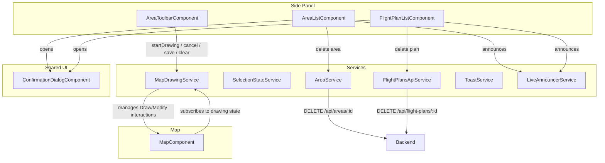

# Design Document: UX Area Management Redesign

## Overview

This design relocates area drawing actions from a floating map overlay into the "Obszary" (Areas) side-panel section, introduces area and flight-plan deletion with cascade behavior, and adds an accessible confirmation dialog component. The goal is to unify all area management controls in a single contextual location, reduce UI fragmentation, and provide destructive-action safety through confirmation prompts.

Key design decisions:
- **Toolbar integration over overlay**: Moving draw/clear/save into the side panel ties the action to the list it modifies, reducing cognitive distance.
- **Shared `MapDrawingService`**: A new service mediates between the side-panel toolbar and the map component, replacing direct signal bindings through the template. This keeps the map component focused on rendering.
- **Reusable `ConfirmationDialogComponent`**: A generic, accessible modal dialog used for both area and flight-plan deletion.
- **Backend cascade via EF Core**: The existing `OnDelete(DeleteBehavior.Cascade)` on `FlightPlanEntity.AreaId` FK handles area deletion automatically — no extra logic needed.

## Architecture



### Communication Flow

1. **Drawing initiation**: `AreaToolbarComponent` calls `MapDrawingService.startDrawing()`.
2. **Map reacts**: `MapComponent` watches `MapDrawingService.isDrawing` signal and adds/removes `Draw` interaction.
3. **Drawing completion**: `MapDrawingService` emits polygon coordinates via a signal; `AreaToolbarComponent` transitions to "polygon ready" state.
4. **Save**: `AreaToolbarComponent` calls `MapDrawingService.submitArea()` which delegates to `AreaService.createArea()`.
5. **Deletion**: List components open `ConfirmationDialogComponent`, then call the appropriate API service on confirmation.

## Components and Interfaces

### New Components

#### `AreaToolbarComponent`
- **Selector**: `app-area-toolbar`
- **Location**: `Web/src/app/components/area-toolbar/`
- **Responsibility**: Render draw/cancel/save/clear buttons; display validation errors
- **Inputs**: None (injects `MapDrawingService`)
- **State machine**:
  - `idle` → shows "Nowy obszar" button
  - `drawing` → shows "Anuluj" button, hides "Nowy obszar"
  - `polygon-ready` → shows "Zapisz" + "Wyczyść" buttons
  - `submitting` → disables buttons, shows spinner on "Zapisz"

#### `ConfirmationDialogComponent`
- **Selector**: `app-confirmation-dialog`
- **Location**: `Web/src/app/components/confirmation-dialog/`
- **Responsibility**: Accessible modal dialog for confirming destructive actions
- **Inputs**:
  - `title: InputSignal<string>` — dialog heading
  - `message: InputSignal<string>` — descriptive text (supports plan count warning)
  - `confirmLabel: InputSignal<string>` — defaults to "Usuń"
  - `cancelLabel: InputSignal<string>` — defaults to "Anuluj"
  - `loading: InputSignal<boolean>` — disables buttons during operation
- **Outputs**:
  - `confirmed: OutputEmitter<void>`
  - `cancelled: OutputEmitter<void>`
- **Accessibility**: `role="alertdialog"`, `aria-modal="true"`, `aria-labelledby`, `aria-describedby`, focus trap, Escape closes

### New Services

#### `MapDrawingService`
- **Location**: `Web/src/app/services/map-drawing.service.ts`
- **Responsibility**: Mediate drawing state between side-panel toolbar and map component
- **Signals**:
  - `isDrawing: WritableSignal<boolean>`
  - `hasPolygon: WritableSignal<boolean>`
  - `isSubmitting: WritableSignal<boolean>`
  - `validationResult: WritableSignal<ValidationResult | null>`
  - `drawnCoordinates: WritableSignal<number[][] | null>` — WGS84 outer ring
- **Methods**:
  - `startDrawing(): void`
  - `cancelDrawing(): void`
  - `clearPolygon(): void`
  - `setPolygonCoordinates(coords: number[][]): void` — called by map after draw ends
  - `submitArea(): Observable<AreaResponse>`
- **Computed**:
  - `isValid: Signal<boolean>`
  - `validationErrors: Signal<string[]>`
  - `toolbarState: Signal<'idle' | 'drawing' | 'polygon-ready' | 'submitting'>`

### Modified Components

#### `MapComponent`
- **Remove**: `MapToolbarComponent` import and template usage
- **Remove**: `toolbar-overlay` div
- **Add**: Inject `MapDrawingService`, react to `isDrawing` signal to add/remove `Draw` interaction
- **Keep**: `MapSearchComponent` as sole overlay, validation visual styles, selected area rendering

#### `AreaListComponent`
- **Add**: Delete button on each area item (visually hidden until hover/focus, always in DOM)
- **Add**: Inject `AreasApiService` for delete, `ToastService` for error feedback, `LiveAnnouncerService`
- **Add**: Integration with `ConfirmationDialogComponent`
- **Add**: Flight plan count fetch for cascade warning (via `FlightPlansApiService.list()`)

#### `FlightPlanListComponent`
- **Add**: Delete button on each plan item (same hover/focus visibility pattern)
- **Add**: Integration with `ConfirmationDialogComponent`
- **Add**: `LiveAnnouncerService` announcements on list changes

### Removed Components

#### `MapToolbarComponent`
- **Entire component removed**: `map-toolbar.component.ts`, `.html`, `.scss`
- **Reason**: Functionality moved to `AreaToolbarComponent` in side panel

### Backend Changes

#### `AreasEndpoint` — New DELETE endpoint
```
DELETE /api/areas/{id:guid} → 204 No Content | 404 Not Found | 400 Bad Request
```

#### `FlightPlansEndpoint` — New DELETE endpoint
```
DELETE /api/flight-plans/{id:guid} → 204 No Content | 404 Not Found | 400 Bad Request
```

#### New CQRS Commands
- `DeleteAreaCommand(Guid Id)` + `DeleteAreaCommandHandler`
- `DeleteFlightPlanCommand(Guid Id)` + `DeleteFlightPlanCommandHandler`

### Frontend API Services

#### `AreasApiService` — Add method
```typescript
deleteArea(id: string): Observable<void> {
  return this.http.delete<void>(`${this.basePath}/areas/${id}`);
}
```

#### `FlightPlansApiService` — Add method
```typescript
deleteFlightPlan(id: string): Observable<void> {
  return this.http.delete<void>(`${this.basePath}/${id}`);
}
```

## Data Models

### Existing Entities (No Changes)

- **AreaEntity**: `Id`, `CreatedAt`, `Geometry` (PostGIS Polygon 4326)
- **FlightPlanEntity**: FK `AreaId` with `OnDelete(DeleteBehavior.Cascade)` — handles cascade automatically

### New Command Models

```csharp
// DeleteAreaCommand.cs
public record DeleteAreaCommand(Guid Id) : IRequest<bool>;

// DeleteFlightPlanCommand.cs
public record DeleteFlightPlanCommand(Guid Id) : IRequest<bool>;
```

### Frontend State Models

```typescript
// AreaToolbar state machine
type AreaToolbarState = 'idle' | 'drawing' | 'polygon-ready' | 'submitting';

// ConfirmationDialog config
interface ConfirmationDialogConfig {
  title: string;
  message: string;
  confirmLabel?: string;    // default: 'Usuń'
  cancelLabel?: string;     // default: 'Anuluj'
}
```

### API Response Contracts (Existing — No Changes)

- `AreaResponse`: `{ id, createdAt, geometry }`
- `FlightPlanResponse`: `{ id, areaId, mode, waypoints, statistics, createdAt }`

## Correctness Properties

*A property is a characteristic or behavior that should hold true across all valid executions of a system — essentially, a formal statement about what the system should do. Properties serve as the bridge between human-readable specifications and machine-verifiable correctness guarantees.*

### Property 1: Validation error display truncation

*For any* list of validation errors of length N (where N > 0), the Area Toolbar SHALL display at most min(N, 5) error messages, and the "Zapisz" button SHALL be disabled.

**Validates: Requirements 1.6**

### Property 2: Deletion clears selection state

*For any* area that is the currently selected area (selectedAreaId matches the deleted area's ID), after successful deletion, the selectedAreaId SHALL be null and the plans list SHALL be empty.

**Validates: Requirements 3.5**

### Property 3: Confirmation dialog shows cascade plan count

*For any* area with N associated flight plans where N > 0, the confirmation dialog message SHALL contain the number N indicating how many plans will be deleted.

**Validates: Requirements 3.6**

### Property 4: DELETE area endpoint correctness with cascade

*For any* existing area (with 0..N associated flight plans), sending DELETE /api/areas/{id} SHALL return status 204, and afterwards neither the area nor any of its previously associated flight plans SHALL exist in the database.

**Validates: Requirements 4.1, 4.4**

### Property 5: Invalid GUID format returns 400

*For any* string that is not a valid GUID format, sending DELETE /api/areas/{value} SHALL return status 400 Bad Request.

**Validates: Requirements 4.2**

### Property 6: Flight plans sorted descending by createdAt

*For any* list of flight plans returned for a selected area, for every consecutive pair (plan[i], plan[i+1]), plan[i].createdAt SHALL be greater than or equal to plan[i+1].createdAt.

**Validates: Requirements 5.6**

### Property 7: Flight plan item displays all required fields

*For any* FlightPlanResponse with valid statistics, the rendered plan item SHALL contain: the mode label (Grid or POI), the createdAt date, the total distance rounded to an integer in meters, the flight time formatted as "X min Y s", and the photo count.

**Validates: Requirements 5.7**

### Property 8: Confirmation dialog displays resource name

*For any* non-empty resource name string passed to the confirmation dialog, the rendered dialog SHALL contain that exact string and the confirmation question text.

**Validates: Requirements 7.1**

### Property 9: Focus trap containment

*For any* sequence of Tab key presses while the confirmation dialog is open, keyboard focus SHALL remain on elements within the dialog and SHALL cycle through them without escaping to the background.

**Validates: Requirements 7.3**

### Property 10: Aria-live announces plan count on change

*For any* change to the flight plans list (plan added or removed), the aria-live region SHALL announce a message containing the new total count of plans.

**Validates: Requirements 8.5**

## Error Handling

### Frontend Error Handling

| Scenario | Behavior |
|----------|----------|
| DELETE area fails (network/server) | Close dialog, show inline error in area list, preserve area in list |
| DELETE flight plan fails | Show inline error near plan item, preserve plan, re-enable delete button |
| Area creation fails during save | Show error in toolbar (reuse existing `submissionError` pattern), keep polygon on map |
| Flight plan list load fails | Show error with retry button (existing pattern) |
| Invalid polygon drawn | Disable save, show max 5 validation error messages |

### Backend Error Handling

| Scenario | HTTP Status | Response |
|----------|-------------|----------|
| DELETE area — area exists | 204 | Empty body |
| DELETE area — not found | 404 | ProblemDetails |
| DELETE area — invalid GUID | 400 | ProblemDetails |
| DELETE flight plan — plan exists | 204 | Empty body |
| DELETE flight plan — not found | 404 | ProblemDetails |
| DELETE area — DB error | 500 | ProblemDetails (via GlobalExceptionHandler) |

### Error Display Strategy

- **Inline errors** for list operations (area/plan deletion failures) — displayed as a temporary message within the list component, dismissed on next user action.
- **Toast notifications** reserved for transient success messages (e.g., "Obszar usunięty").
- **Dialog-level feedback** NOT used — dialog closes on confirm to avoid blocking UX; errors appear in the parent list.

## Testing Strategy

### Property-Based Testing

**Library**: [fast-check](https://github.com/dubzzz/fast-check) for TypeScript/Angular tests, [FsCheck](https://fscheck.github.io/FsCheck/) for .NET backend tests.

**Configuration**: Minimum 100 iterations per property test.

**Tag format**: `Feature: ux-area-management-redesign, Property {number}: {property_text}`

Properties to implement:
1. **Property 1** (error truncation) — Generate arrays of 0–20 error strings, verify max 5 displayed
2. **Property 2** (deletion clears selection) — Generate random area IDs, set as selected, delete, verify null
3. **Property 3** (cascade count in dialog) — Generate areas with 1–50 plans, verify count in message
4. **Property 4** (DELETE endpoint cascade) — Generate areas with 0–10 plans in test DB, verify clean removal
5. **Property 5** (invalid GUID 400) — Generate arbitrary non-GUID strings, verify 400
6. **Property 6** (sort order) — Generate lists of plans with random dates, verify descending order after sort
7. **Property 7** (plan display fields) — Generate random FlightPlanResponse, verify all fields in rendered output
8. **Property 8** (dialog resource name) — Generate random strings, verify they appear in dialog
9. **Property 9** (focus trap) — Generate random Tab sequences (n=1..50), verify focus stays in dialog
10. **Property 10** (aria-live plan count) — Generate plan list mutations, verify announcement content

### Unit Tests (Example-Based)

- Toolbar state machine transitions: idle → drawing → polygon-ready → submitting → idle
- Cancel during drawing clears partial polygon
- MapComponent no longer renders toolbar overlay
- MapComponent still renders MapSearch
- CSS active class applied during drawing
- Spinner shown during submission
- Delete button in DOM regardless of hover (accessibility)
- Dialog opens with correct ARIA attributes
- Focus returns to trigger element on dialog close
- Escape key closes dialog

### Integration Tests

- Full area deletion flow: click delete → confirm → API call → area removed from list
- Full plan deletion flow: click delete → confirm → API call → plan removed + flight path cleared
- Drawing from toolbar triggers map Draw interaction
- Area save from toolbar updates area list and selection

### E2E Considerations

- Keyboard-only navigation through area list, delete flow, and dialog
- Screen reader announcement verification (if CI supports aXe or similar)
